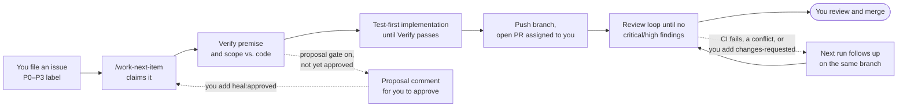

# backlog-loop

**A GitHub template for repositories where [Claude Code](https://code.claude.com/docs/en/overview) does the work and a human merges.**

## Quickstart

From one issue to a PR assigned to you, given the [requirements](#requirements):

1. `gh repo create my-app --private --template highhair20/backlog-loop --clone && cd my-app`
2. `scripts/setup.sh --fix` swaps in the `CLAUDE.md` skeleton and creates the labels.
3. Put your build and test commands in `CLAUDE.md` under `## Verify`.
4. `rm -f CLAUDE.md.template-own && git add -A && git commit -m "chore: set up backlog-loop" && git push` (the loop starts only from a clean, pushed `main`).
5. File one issue with the feature or bug form, and give it one priority label, `P0`–`P3`.
6. In Claude Code, in the repo, run `/work-next-item`.

CI stays red and `main` stays unprotected until you finish the
[detailed setup](#getting-started), so do that before running the loop unattended.

## What it is

It gives an AI coding agent a structured backlog to work from, a definition of
"done" to meet, a review loop to pass, and guardrails that keep it from merging or
pushing to `main`. You file issues; the agent turns them into reviewed pull
requests; you decide what ships.

Everything here is plain files — Claude Code settings, shell scripts, GitHub issue
templates, and a workflow — so there is no service to run and nothing to install
beyond the tools you already use.

## Who it is for

- Solo developers and small teams who want to hand a backlog to Claude Code and
  review PRs rather than write every change by hand.
- Anyone running Claude Code **unattended** (headless `claude -p`, `/loop`, or a
  scheduled cloud routine) who needs the safety rules to live in the repository,
  where every session can see them, rather than in one person's local config.

## What it does

| Capability | What you get |
|---|---|
| **Merge and push guardrails** | A committed `.claude/settings.json` that denies merging PRs (CLI, REST API, and GitHub MCP tools), pushing to `main`, force pushes, tag pushes, and the GitHub MCP file-write tools. Because it is committed, it applies to headless sessions too, and to cloud sessions that load the repo's settings; check a scheduled routine with the first dry run in [`docs/ROUTINE.md`](docs/ROUTINE.md#the-first-dry-run). |
| **Autonomous backlog loop** | Before new work, `/work-next-item` follows up on its own open PRs: it fixes failing checks and conflicts with `main`, and makes the changes you ask for with the `changes-requested` label, on the same branch. Otherwise it takes the highest-priority open issue, checks that the issue's diagnosis matches the code, derives the full scope from the code rather than the issue text, implements it test-first, runs your verify commands, and opens a PR assigned to you. One issue, one branch, one PR — never merged. |
| **Scheduled routine** | [`docs/ROUTINE.md`](docs/ROUTINE.md) sets the loop up as a Claude Code routine that works one issue an hour in the cloud. A proposal gate in `CLAUDE.md` holds hand-written issues for your approval (`heal:approved`) before any code, and `/work-next-item --dry-run` shows what a run would do while writing nothing. |
| **Cold-context driver** | `scripts/backlog-loop.sh` runs one issue per fresh `claude -p` session, so a long backlog never exhausts a context window. All state lives in git and issue labels, so it is safe to stop and resume at any time. |
| **Specialist reviewers** | Two reviewer agents, `pr-test-analyzer` and `silent-failure-hunter`, that the loop runs before opening each PR in any repo whose `CLAUDE.md` lists them under `## Specialist reviewers`. The skeleton `CLAUDE.md` does; a repo synced with an existing `CLAUDE.md` must add that table (copy it from the template). They are vendored from [ECC](https://github.com/affaan-m/ECC) (MIT) by `scripts/vendor-agents.sh`, which adds your repo's context, so they work in cloud sessions that load no plugins. It vendors only from the ECC commit pinned in `scripts/ECC_PIN`; `--adopt` takes a newer one once you have reviewed it. Optional stack reviewers (`go-reviewer`, `database-reviewer`, `typescript-reviewer`, `python-reviewer`) ship off by default in `.claude/agent-context/optional/`; see [`docs/BACKLOG.md`](docs/BACKLOG.md#reviewers) to enable one. |
| **PR review loop** | Hooks that start a `/code-review` when a PR is opened and keep the session from ending until the review's critical and high findings are resolved — with a round cap and timeouts so it cannot run forever. |
| **Ready-to-merge notice** | A workflow, `ready-to-merge.yml`, labels a loop PR `ready-to-merge` and mentions you in a comment once the loop is done with it and its required checks pass, so GitHub notifies you without any session watching. The comment says the branch includes `main` only when it has checked, and names the commit of `main` it checked against. The label comes off when the PR gains `changes-requested`, falls behind under a strict ruleset, or has a merge state GitHub has not worked out. The loop keeps its PRs up to date itself: a PR that is only behind `main` (under a strict ruleset) gets "Update branch" on the next run. List the workflows a PR must pass in its `workflow_run` trigger. A ruleset that requires an approving review keeps the loop's PRs from ever reading as mergeable (you cannot approve your own PR), so none is announced. |
| **Issue conventions** | Feature and bug issue forms (the key sections are required fields) and a guide (`docs/ISSUE_GUIDE.md`) that make each issue a self-contained work item an agent can pick up cold, plus a script that creates the priority, status, and proposal-gate labels the loop uses. `/file-issue <one-line idea>` drafts such an issue for you: it checks for duplicates, reads the code the idea touches, shows the draft with a proposed priority, and files it only once you approve. |
| **CI skeleton** | A workflow that runs on branches and PRs with read-only permissions, and fails until you configure it — so a new repo never shows a green check that tests nothing. Actions are pinned to commit SHAs, and Dependabot keeps the pins current. |
| **Repo defaults** | A PR template for PRs opened by hand, and an `.editorconfig` with LF endings, final newlines, and tabs where a format requires them. |
| **Sync for existing repos** | `scripts/sync-guardrails.sh` brings any existing repository up to date with this template without overwriting the parts you have customised. The `backlog-loop` Claude Code plugin runs it for you: `/backlog-loop:install` to adopt the template, `/backlog-loop:update` to catch up later. |

## How it works



The loop is generic. Everything specific to your project comes from sections of
your repo's `CLAUDE.md`:

| Section | Required | What it tells the loop |
|---|---|---|
| `## Verify` | **Yes** | The build, lint, and test commands that define "green". The loop refuses to start without real commands here. |
| `## Definition of done` | No | Checks a green build cannot prove — deploy wiring, infrastructure, docs. |
| `## Scope map` | No | Where to enumerate what an issue could touch — route tables, handler directories, page registries. |
| `## Specialist reviewers` | No | Which reviewer agents in `.claude/agents/` cover which paths. The skeleton enables the two that ship with the template. |
| `## Proposal gate` | No | Whether a hand-written issue gets a proposal for your approval before any code, and which label marks machine-filed issues that skip it. Off in the skeleton. |

## Requirements

- [Claude Code](https://code.claude.com/docs/en/overview), with its `/code-review` command available
- [GitHub CLI](https://cli.github.com/) (`gh`), authenticated
- `git`, `bash`, and [`jq`](https://jqlang.org/)

## Getting started

### A new repository

Click **Use this template** on GitHub, or:

```sh
gh repo create my-app --private --template highhair20/backlog-loop --clone
cd my-app
```

Then run the setup check. It is read-only, lists what is left to do, and gives the
command that fixes each item:

```sh
scripts/setup.sh          # check only
scripts/setup.sh --fix    # also swap in the CLAUDE.md skeleton, fill in Verify for one detected stack, remove the template's CHANGELOG.md, create the labels and the local allowlist, and link the issue guide
```

It exits 0 once nothing is failing, so re-run it until it does. It names the GitHub
repository it checks first. In a checkout with several remotes (a fork with an
`upstream`, say), it uses the repo `gh repo set-default` names and stops if none is
set, rather than letting gh guess; `scripts/backlog-loop.sh` follows the same rule.
The steps it checks:

1. **Fill in `CLAUDE.md`**, above all the `## Verify` section. A new repo starts
   with this template's own `CLAUDE.md`; `setup.sh --fix` replaces it with the
   project skeleton from `templates/CLAUDE.md`, and the loop refuses to run until it
   is replaced. It also removes the template's plugin manifests (`.claude-plugin/`),
   which a new repo does not need. Write every command to run from the repo root and never `cd`,
   because the loop may run several in one shell.

   `setup.sh` proposes the Verify commands from the stack file at the repo root:
   a `Makefile` with a `test` target (which wins over the rest), `package.json`
   (its `lint`, `typecheck`, `build`, and `test` scripts, run with the package
   manager its lockfile names), `go.mod`, `Cargo.toml`, or `pyproject.toml` (only
   the ruff, mypy, and pytest it configures). With one stack, `--fix` writes them
   into the skeleton's Verify block; it never touches a block that already has
   commands. With several, it writes nothing and prints each proposal. It also
   prints the matching `ci.yml` step for step 2, and for Go, TypeScript, or
   Python, the optional reviewer to turn on and the commands that do it.
2. **Configure CI.** Replace the failing placeholder step in
   `.github/workflows/ci.yml` with the same Verify commands, so CI and the loop
   agree on what "green" means. `setup.sh` warns about any Verify command that no
   workflow runs as a whole command: `run: make test`, a line of a `run: |` block,
   or after `&&` all count; `make test-e2e`, a step name, or a comment does not.
   It is a heuristic, not a YAML parse. Then see
   [`docs/CI_HARDENING.md`](docs/CI_HARDENING.md) for steps that stop a green
   check from hiding skipped tests, fetched tools, or flaky coverage.
3. **Create the labels:** `scripts/seed-labels.sh` (or `setup.sh --fix`). It is
   safe to re-run.
4. **Protect `main`:** `scripts/protect-main.sh <owner>/<repo> <ci-job-name>…`.
   It creates a branch ruleset that requires a pull request and the named CI
   checks, and lets admins bypass only by merging a PR. This is the only guardrail
   that holds no matter how a command is phrased, so it is required (see
   [Security](#security)). It is
   safe to re-run. On GitHub Enterprise, put the host in front:
   `scripts/protect-main.sh <host>/<owner>/<repo> …` (`setup.sh` prints it that way).
   A bare `<owner>/<repo>` goes to gh's default host (github.com unless `GH_HOST`
   is set). Add `--strict` to also require a PR's branch to be up to date
   with `main` before it merges: each merge then re-runs CI against the latest `main`,
   so two PRs that pass alone cannot merge into a red `main`. The cost is an update
   and a CI run per merge. A re-run keeps the ruleset's current setting; `--no-strict` turns it
   off. Rulesets are free on public repositories; private repositories
   need a paid GitHub plan.
5. **Allow the loop's commands** if you will run it unattended — see
   [Running the backlog loop](#running-the-backlog-loop).
6. **Link the issue guide** in GitHub's "New issue" chooser, so people see the
   conventions in [`docs/ISSUE_GUIDE.md`](docs/ISSUE_GUIDE.md) before they write
   an issue. The link needs your repo's absolute URL, so the template cannot ship
   it: `setup.sh --fix` adds it to `contact_links` in
   `.github/ISSUE_TEMPLATE/config.yml`, keeping any links already there. It is a
   warning, not a failure.
7. **On a public repo, turn the proposal gate on** (`- Gate: on` under
   `## Proposal gate` in `CLAUDE.md`). `setup.sh` warns when a public repo has it
   off; [Security](#security) says why. It is a warning, not a failure.

### An existing repository

**With the plugin.** In a Claude Code session in your repo (with a clean working
tree):

```text
/plugin marketplace add highhair20/backlog-loop
/plugin install backlog-loop@backlog-loop
/backlog-loop:install
```

`/backlog-loop:install` runs the sync below from the plugin's copy of the template,
then your repo's `scripts/setup.sh --fix`, and reports what is left to do. Later,
`/backlog-loop:update` re-syncs and shows the diff for you to review; it never
commits. Plugins from this marketplace do not update themselves, so first run
`claude plugin marketplace update backlog-loop` and
`claude plugin update backlog-loop@backlog-loop`, then `/reload-plugins`.

The plugin only delivers files. It adds no hooks, agents, or loop command of its
own: the guardrails must be committed in the repo, because a plugin cannot carry
deny rules and a cloud session does not install a repo's plugins.

**Without the plugin.** Clone this template next to your repo and sync it in:

```sh
git clone https://github.com/highhair20/backlog-loop.git
backlog-loop/scripts/sync-guardrails.sh ./my-app     # my-app must have a clean working tree
cd my-app && scripts/setup.sh --fix
```

`setup.sh` then lists anything still missing, such as the branch ruleset.

The sync never commits. Review `git diff` in your repo, then commit it on a branch.
It never writes through a symlink either: if a file it would write, or a directory
above one (such as `.claude`), is a symlink in your repo, it names the link and
changes nothing. A seeded file you already have may be a link, since sync leaves it
alone.
It treats files three ways, so re-running it later is safe:

| Kind | Files | On every sync |
|---|---|---|
| **Managed** | review hooks, `work-next-item.md`, `file-issue.md`, `backlog-loop.sh`, `check-verify-section.sh`, `gh-auth-check.sh`, `gh-repo.sh`, `loop-lock.sh`, `missing-allow-rules.sh`, `protect-main.sh`, `ready-to-merge.sh`, `report-drained.sh`, `seed-labels.sh`, `setup.sh`, `template-version.sh`, `vendor-agents.sh`, `settings.local.json.example`, `docs/ROUTINE.md` | Overwritten. These hold no project-specific content; put customisation in `CLAUDE.md`. |
| **Seeded** | `CLAUDE.md` (the skeleton in `templates/`), CI workflow, the `ready-to-merge.yml` workflow, issue forms, PR template, `dependabot.yml`, `docs/ISSUE_GUIDE.md`, `docs/BACKLOG.md`, `docs/CI_HARDENING.md`, `docs/DEPLOYING.md`, the reviewer agents with their `.claude/agent-context/` and `scripts/ECC_PIN`, the optional stack reviewer contexts in `.claude/agent-context/optional/` | Copied only if missing. Yours to edit. Nothing is added beside an equivalent you already have: the placeholder CI only goes into a repo with no workflows, the issue forms only into one with no issue templates of its own, the PR template only if GitHub finds none anywhere, and `dependabot.yml` not beside a `dependabot.yaml`. `.editorconfig` is never synced; its indent defaults could change how editors treat existing code. |
| **Merged** | `.claude/settings.json`, `.gitignore` | The template's deny rules, hooks, and ignore lines are added; yours are kept. |

Each sync also writes `.claude/template-version`: the template commit your repo now
matches (suffixed `-dirty` if the template clone had uncommitted changes; shortened
to 12 characters when synced from the plugin), and on a second line the release
tag, such as `v0.1.0`, when the clone is checked out on one. Commit it with the
rest, so you can tell later how far behind the template a repo is. Both
`setup.sh` and `backlog-loop.sh` (once, at start-up, before the first item) compare
it with the template's latest commit, so an unattended loop's output says when its
managed files are out of date. A repo that is behind is told by how many commits, by
tag when there is one, with a link to the changes on GitHub (needs `gh`; otherwise
the two commits). The check never stops the driver, and an unreachable template is a
one-line warning. To sync a release rather than the latest
`main`, check out its tag in the template clone first
(`git -C backlog-loop checkout v0.1.0`). Each release's notes in
[`CHANGELOG.md`](CHANGELOG.md) list what changed and, because seeded files are not
updated, what to change by hand. The plugin's own manifests (`.claude-plugin/`) are
never synced.

## Running the backlog loop

Write issues with the templates, give each exactly one priority label (`P0`–`P3`;
`P3` is taken only once no `P0`–`P2` issue is actionable), then choose how to run it:

| How | When |
|---|---|
| `/work-next-item` in a Claude Code session | Work one issue while you watch. |
| `/loop /work-next-item` | Keep working issues in one session. |
| `scripts/backlog-loop.sh` | Unattended. Each issue or PR follow-up gets a fresh `claude -p` session; stops when nothing is left to work or follow up, when an item changes nothing on GitHub, or after `MAX_ITEMS` (default 25). |
| A scheduled routine | Unattended in the cloud, one issue per run, starting in dry run. See [`docs/ROUTINE.md`](docs/ROUTINE.md). |
| `/work-next-item --dry-run` | See which issue a run would take and what it would do, without writing anything. |

**Unattended runs need permissions.** A headless session cannot ask you to approve
a command, so allow everything the loop runs in `.claude/settings.local.json`.
Start from the example, then add your Verify commands to its `allow` list:

```sh
cp .claude/settings.local.json.example .claude/settings.local.json
```

The example covers every `gh` and `git` command `/work-next-item` runs; a test
keeps the two in step. The committed deny rules still win over any allow rule, so
merges and pushes to `main` stay blocked. If a command every
iteration runs, or a Verify command, is missing, the first item stops without giving up,
and the driver reports "no progress"; that item's log in `.loop-logs/` names the
refused command and the allow rule to add. Sync updates the example but never your
copy, so `backlog-loop.sh` (and `setup.sh`) name each rule the example has and your
copy lacks before the first item; the driver still runs. A refusal only one issue meets, such
as an edit under `.claude/`, gives that issue up as `needs-attention` instead, and
the loop moves on.

If a session made no progress and also left uncommitted edits, or commits no remote
has, the driver names the branch and that session's log. Usually the session ended
its turn while a command it started was still running, so the work never reached a
commit or a push.

**Logs are private.** Each session's log holds its whole transcript: issue text,
code, and command output. So the driver writes each log as mode 600, creates its
log directory as mode 700, and tightens an existing `.loop-logs/` you own to 700. A
`LOG_DIR` you point elsewhere that already exists keeps its permissions; the driver
warns if other users can get into it.

**One driver at a time.** `backlog-loop.sh` holds a lock in the git directory
(`.git/backlog-loop.lock`) while it runs, so a second driver in the same clone
refuses to start, whatever its `LOG_DIR`. A lock left by a crashed or killed run is
reclaimed automatically, because it records its owner's PID. If a run is refused and
you know no loop is running, the message gives the `rm -rf` that clears the lock.

The loop manages these status labels: `in-progress`, `in-review`, `blocked`,
`needs-infra`, and `needs-attention` (it gave up and a human should look). To ask
for changes on one of its PRs, comment on the PR and add `changes-requested` to it;
the next run makes them and removes the label. Its own PRs come before new issues:
each run first fixes one that has failing checks, a conflict, or that label. With the
proposal gate on, it also uses `heal:proposed` (a proposal awaits you) and
`heal:approved` (you approved it). It never selects an issue labelled `no-auto-heal`.
See [`docs/ISSUE_GUIDE.md`](docs/ISSUE_GUIDE.md) for the full set.

## Safety model

The guardrails are layered, from softest to hardest:

1. **Instructions** — `CLAUDE.md` and the loop command say never to merge or push
   to `main`.
2. **Permission rules** — `.claude/settings.json` denies those commands and tools
   outright, in every local and headless session, and in cloud sessions that load
   the repo's settings. Check a scheduled routine before relying on them there
   ([`docs/ROUTINE.md`](docs/ROUTINE.md#the-first-dry-run)).
3. **CI** — required checks run on every PR.
4. **Branch ruleset** — GitHub itself refuses a direct push or unreviewed merge to
   `main`. You set this up once per repo.
5. **You** — every change reaches `main` only through a merge you make.

## Security

The loop acts with your credentials: your `gh` login, your git push access, and
whatever your shell can reach. Know what that lets it do.

- **Issue bodies and comments are untrusted input that steers the loop.** The model
  reads them as its task. A misleading issue can ask for code that does something
  other than what its title says.
- **Labelling an issue tells the loop to follow it.** A priority label (`P0`–`P3`)
  is what makes an issue selectable. Only people with triage access can add one,
  but adding it is your approval of what the issue says.
- **Verify runs repo code as you.** A headless session accepts its own edits and
  then runs your Verify commands, so code an issue asked for runs with your
  credentials before you see a PR.

**On a public repository,** where anyone can open an issue:

- **Turn the proposal gate on** (`- Gate: on` under `## Proposal gate` in
  `CLAUDE.md`). A hand-written issue then gets a proposal for you to approve with
  `heal:approved` before any code runs. `setup.sh` warns when a public repo has it
  off. Issues carrying the section's `Machine-filed label` skip the proposal, so
  leave it `none`, or name a label only your automation applies: never one an issue
  form adds by itself, such as `bug` or `enhancement`.
- **Label only issues you have read**, comments included.
- **Run unattended loops in an isolated environment**: a container, a VM, or a
  scheduled routine ([`docs/ROUTINE.md`](docs/ROUTINE.md)), with a fine-grained
  token limited to this one repository rather than your everyday login.

**The `protect-main` ruleset is required, not optional** (Getting started, step 4).
It is the only guardrail that holds whatever the command text: the deny rules match
spellings, and some forms get past them (see [Limits](#limits)).

## Limits

- **Permission rules match command text; they are a filter, not a wall.** A
  sufficiently unusual spelling of a push to `main` can get past them. The branch
  ruleset in step 4 is the hard block, so it is required, not optional.
- The deny rules also refuse git options that run a program or write a file
  (`--upload-pack`, `--receive-pack`, `--exec`, `--output`, `git -c`, `git config`)
  in the spellings they cover, abbreviations and a leading global option included, in
  interactive sessions too; run those in a plain terminal if you need them. A spelling
  they miss is still not on the unattended allowlist, so a headless session cannot run
  it, but an interactive session would ask you rather than refuse. Claude Code itself refuses edits under `.git/` (a "sensitive file", even
  with edits auto-approved), so a session cannot plant a git hook or config instead.
  A headless session still runs your Verify commands, which run this repo's code with
  your credentials: label only issues you have read, and see [Security](#security).
- The deny rules block merging through `gh api`, but not other raw API writes: a
  `gh api -X PUT repos/<owner>/<repo>/contents/<path>` can still write to `main`.
  The branch ruleset blocks that too.
- The push rule for git global options (`git -C <dir> push …`) also denies a few
  non-push commands, such as `git -C . commit -m "fix push flow"`. Commit without
  `-C`.
- The rule that blocks pushing a release tag (`git push origin v1.2.3`, because tags
  often trigger deploys) also blocks pushing any branch whose name starts with `v`.
  The loop's `<type>/<issue>-<slug>` branch names never do. The deploy pattern this
  rule assumes, and a test that keeps dev and prod deploying the same things, is in
  [`docs/DEPLOYING.md`](docs/DEPLOYING.md).
- The review hook finds the new PR's URL in `gh pr create`'s output. If you capture
  that output (`URL=$(gh pr create …)`), no review loop opens; start one by hand
  with `.claude/hooks/pr-review-state.sh seed <pr> <url>`.
- A headless session cannot edit `.claude/`, so the loop cannot work an issue that
  changes its own command, hooks, or settings there (`scripts/` is fine). Label such issues `no-auto-heal` and work them in an
  interactive session.
- In an unattended run, the review after each PR is Claude Code's built-in
  `/code-review`, and the allowlist covers the commands it reads the PR with
  (`gh pr view`, `gh pr diff`). A command it is refused, such as one a later Claude
  Code version adds, makes it fall back (to the PR's file list, say) and say so in
  its report, rather than fail. [`docs/BACKLOG.md`](docs/BACKLOG.md) shows how to
  re-check after upgrading.
- Run one loop per repository at a time, local or scheduled. Step 0 treats any
  `in-progress` issue as a run that died, so two runners would recover each other's
  work ([#57](https://github.com/highhair20/backlog-loop/issues/57)).
- The sync only ever adds deny rules. A rule later removed from the template stays
  in repos that already have it; delete it by hand.
- Known issues and planned improvements are tracked in
  [Issues](https://github.com/highhair20/backlog-loop/issues).

## What's in the repo

```text
.claude-plugin/              the installer plugin: marketplace, manifest, /backlog-loop:install and :update (removed in new repos)
.claude/
  settings.json              deny rules + hook registration (committed on purpose)
  settings.local.json.example  allowlist for unattended runs (copy, then add Verify)
  commands/work-next-item.md the backlog loop command
  commands/file-issue.md     /file-issue: drafts an issue from an idea, files it on approval
  hooks/pr-*.sh              PR review loop
.github/
  ISSUE_TEMPLATE/            feature and bug issue forms
  pull_request_template.md   PR body for PRs opened by hand
  dependabot.yml             weekly updates for the pinned actions
  workflows/ci.yml           CI skeleton (fails until configured)
  workflows/template-self-test.yml   tests this template's scripts; inert in your repo
  workflows/ready-to-merge.yml   labels and announces loop PRs that are ready to merge
docs/ISSUE_GUIDE.md          how to write issues the loop can work
docs/BACKLOG.md              operating the loop: drivers, one iteration, definition of done, task runner conventions, why each guardrail
docs/CI_HARDENING.md         CI patterns that keep a green check honest, with snippets
docs/DEPLOYING.md            dev on main, prod on a v* tag, and a test that keeps the two in step
docs/ROUTINE.md              running the loop as a scheduled cloud routine, dry run first
scripts/
  backlog-loop.sh            unattended driver
  check-verify-section.sh    refuses to run without Verify commands
  gh-auth-check.sh           is gh logged in to origin's host? (other hosts don't count)
  gh-repo.sh                 which repo gh acts on; stops if several remotes and no gh default
  loop-lock.sh               one loop run per clone; reclaims a crashed run's lock
  missing-allow-rules.sh     names allow rules the example has and your local allowlist lacks
  ready-to-merge.sh          labels ready loop PRs and tells you (run by the workflow)
  report-drained.sh          tells backlog-loop.sh a session found nothing to do
  sync-guardrails.sh         update an existing repo from this template
  setup.sh                   check the repo is ready for the loop; --fix the safe parts
  template-version.sh        how far behind the template this repo is (setup.sh and the driver)
  vendor-agents.sh           rebuild .claude/agents/ from ECC plus .claude/agent-context/
  ECC_PIN                    the ECC commit vendor-agents.sh accepts; --adopt moves it
  seed-labels.sh             create the standard labels
  protect-main.sh            create the branch ruleset on main
  test-*.sh                  tests for the scripts above
  run-tests.sh               run every test-*.sh (this repo's Verify; not synced)
templates/CLAUDE.md          skeleton for your project's instructions
.claude/agent-context/optional/     optional stack reviewer contexts (off until copied into .claude/agent-context/)
CLAUDE.md                    this template repo's own instructions (replaced in new repos)
CHANGELOG.md                 the template's release notes (removed from new repos by setup.sh --fix; never synced)
.editorconfig                editor defaults
```

## Contributing

Issues and pull requests are welcome. Run the tests before opening a PR:

```sh
scripts/run-tests.sh
shellcheck --severity=warning scripts/*.sh .claude/hooks/*.sh
```

These are the Verify commands in this repo's `CLAUDE.md`, and CI runs the same two,
so the backlog loop can work this repo's own issues. The tests are plain bash and
need only `git`, `jq`, and `ruby` (for YAML); a new `scripts/test-*.sh` is picked up
automatically.

A PR that changes what repos receive adds a line under `## [Unreleased]` in
[`CHANGELOG.md`](CHANGELOG.md), and, if it changes a seeded file, says under
**Manual steps for existing repos** how a synced repo applies the change.

### Cutting a release

Releases are tagged by the maintainer, by hand. The committed deny rules block the
loop from pushing a `v*` tag, on purpose.

1. In a PR, rename `## [Unreleased]` in `CHANGELOG.md` to `## [X.Y.Z] - YYYY-MM-DD`,
   add a fresh empty `## [Unreleased]` section above it, and update the compare
   links at the bottom. Pick the version by [Semantic Versioning](https://semver.org/);
   before 1.0.0, a change to the deny rules or the `CLAUDE.md` contract is a minor bump.
2. Merge the PR.
3. Tag the merge commit on `main` and push the tag:
   ```sh
   git switch main && git pull --ff-only
   git tag -a vX.Y.Z -m vX.Y.Z
   git push origin vX.Y.Z
   ```
4. Publish a GitHub release from the tag, with that version's changelog section as
   its notes: `gh release create vX.Y.Z --title vX.Y.Z --notes-file <section>`.

## License

[MIT](LICENSE)
